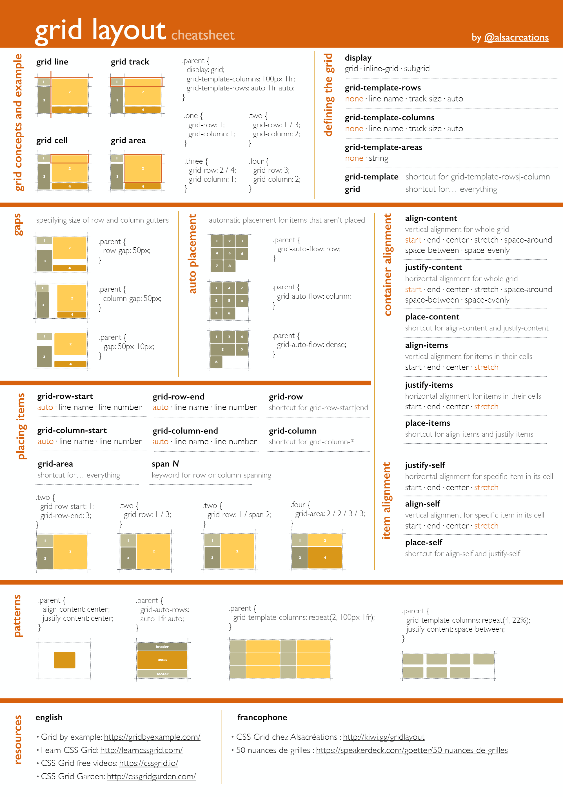

# Styling Projects

To run any of these inside a NGiNX docker container:

- Make sure you have docker installed
- Run the **build-container.sh** script
- Make sure the created container is running in docker
- Run the **dockerize.sh** script in the desired project folder

_Just the last step will suffice to change between projects._

## Installing SASS

- Install Node.js:

  https://nodejs.org/en/download/

- Install Sass (with npm):

  > npm install -g sass

- Install Sass (with Chocolatey):

  > choco install sass

## Compiling SCSS to CSS

To compile sass to css using the command line:

> sass index.scss index.css

Tip: Look for auto-compile plugins for you favorite IDE. These can watch for changes in your scss and automatically compile when needed.

## Flex / Grid

**CSS Flexible Box Layout**, commonly known as FlexBox, is a CSS 3 web layout model. It is in the W3C's candidate recommendation (CR) stage. The flex layout allows responsive elements within a container to be automatically arranged depending upon screen size (or device).


For more about flex, go [here](flex/README.md).

**CSS Grid Layout**, or CSS Grid creates complex responsive web design layouts more easily and consistently across browsers. There have been other methods for controlling web page layout methods, such as tables, the box model, and CSS flex box. CSS grid is currently not an official standard (it is a W3C Candidate Recommendation) although it has been adopted by most major browsers.



For more about grid, go [here](grid/README.md)

## Colors

Color notations:

- Built-in
- Hex-value (hexagonal)
- Rgb-value (red-green-blue)
- Hsl-value (hue-saturation-lightness)

```
.color {
  background-color: red;
  background-color: #454531;
  background-color: rgb(243, 13, 57);
  background-color: hsl(107, 54%, 67%);
}
```

Hsl-values are by far the most relatable notations of colors we can work with:


They are:

- More easy to read
- Give a better overlook of the palette
- Work well with variables

```
.color  {
  --hue: 200;
  --saturation: 100%;
  --lightness: 50%;
  background-color: hsl(var(--hue), var(--saturation), var(--lightness));
}

.color:hover {
  --lightness: 30%;
}
```

---

Date of creation: 7-18-2021
